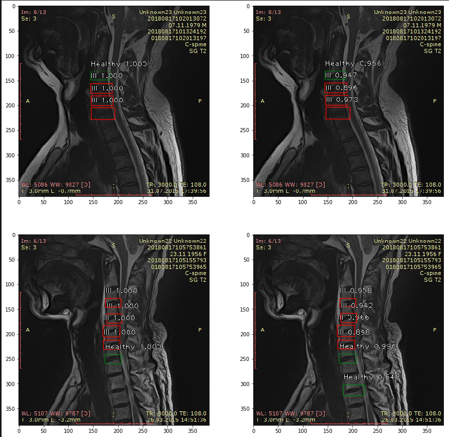

#
SPINAL PATOLOGY DETECTION

Проект по детекции патологий шейного отдела позвоночника по МРТ сникам.

-----

###Входные данные
Входные данные представлены файлами разметки: 
- с определением кординат прямоугольников указывающих регион конкретного позвонка и указанием его класса: Больной, Здоровый, подозрение на патологию и др.
- с файлами изображений МРТ
Всего файлов разметки: 960 из них: 365 или 40% пригодны для постоения модели.

######
Общий вид снимков МРТ

######
Детекция и классификация больных и здоровых дисков на основании данных разметки

----

###Подготовка датасета
- Координаты точек многоугольников в исходных данных были представленны в случайной последовательности.  
- Исходные данные соедржат 8 классов. И-за небольшого размера датасета и изначальной постановки задачи бинарной классификации (а не мультиклассовой) классы были обьединены в 2 класса "Больной" и "Здоровый" исходя из признаков принадлежности к этим классам. 
- Классы не сбалансированы. Размер нулевго класса(здоровый) на 228% больше первого(больной). При детальном рассмотрении видно, что эти перекосы обусловлены либо предпочтениями исследователей размечающих данные либо попадающим к ним на разметку данным, отдельные исследователи размечают очень много здоровых и мало больных позвонков.
- Данные были размечены 3-мя исследователями. Кол-во размеченных данных каждым исследователем неравномерно, так же есть сильные перекосы в пользу разметки одного класса - разные для каждого исследователя.
- Координаты точек по большей части распределены нормально, хотя и наблюдаестся скошенность Y координат в области значений в диаппазоне 160-225. Возможно это может обьясняться, тем что большинство патологий(гипотеза) на представленных данных находится в зоне верхних шейных позвонков.
- Все снимки монохромные и сделаны с одного ракурса. Это говорит о низкой вариативности принаков, а также низкой эффективности применения аугументации поворотом картинок.

Перед подготовкой датасета для обучения координаты точек были преведены к нотации: (левая верхняя кордината, правая верхняя, правая нижняя, левая нижняя.) Далее были выделены классы со статистиками: таргет класса, Исследователя, количества классов в картинке. Далее классы были консолидированы в один класс, по которому делалась балансировка датасета таким образом, чтобы в обучающую и тестовую выборку попало равное ко-во экземаляров класса. Соотношение трейн/тест: 67%/33%
Обада тасета были преобразованны в формат файла пригодного для загрузки генератором модели.
Препроцессинг изображений осущетвляется на этапе, загрузки данных в модель.
Весь процесс анализа представлен в файле: [Dataset_creation.ipynb](Dataset_creation.ipynb)

---

###Выбор модели
Для решения задачи расматривались следующие архитектуры нейронных сетей.
Двухстадийные: <b>RCNN, Fast_RCNN, Faster-RCNN</b>
Одностадийные: <b>SSD, YOLO, RetinaNet</b>
Одностадийные модели требуют гораздо меньше времени на обучение и более простой реализации, при схожем качестве детекции. SSD и RetinaNet используют <b>FPN(Feature Pyramid Networks)</b> в качестве основы которые хорошо могут выделять признаки различного масштаба. YOLO имеет приоритет в скорости инференса и более низкое качество на задачах детекции. Использование <b>Focal Loss в RetinaNet</b> позволяет снизить чувствиетльность ошибки сети на большое количество обьектов фона легко идентифицируемых классификатором как положительные против малого кол-ва обьектов искомого класса. т.е. <b>Focal Loss в RetinaNet</b> может иметь лучшие характеристики для выборок с несбалансированными классами.
В конечном итоге с учетом вышеописанных характеристик была выбрана архитектура <b>RetinaNet</b> 

---
### Обучение
Для обучения была использована библиотека проекта [keras-retinanet](https://github.com/fizyr/keras-retinanet), с небольшимми доработками, backend <b>TensorFlow</b>.
В качестве генратора признаков используется сверточная сеть <b>ResNet-50</b> с весами <b>ImageNet</b>
В качестве целевой функции ошибки используеться <b>α-Balanced FocalLoss</b> c параметрами <b>(α-0.25, γ-2)</b>
Препроцессинг данных: изображения нормализаются используя стандартную схему нормализации для весов ImageNet-tf, шкалируются в размер 224х224
Код обучения модели в файле: [Train_colab.ipynb](Train_colab.ipynb)

---
###Результаты

Не смотря на "правильные" кривые лосса и метрик, модель переобучилась из-за сильного перекоса,т.е. большого кол-ва 0-го класса который вносит большой вклад в итоговый лосс и завышает mAP.
Результаты предствалены в [Inference.ipynb](Inference.ipynb)

----

#####Некоторые особенности библиотеки [keras-retinanet](https://github.com/fizyr/keras-retinanet):
- неэффективная реализация генераторов, 
    - то что называется генераторами по сути генераторами не является, а является просто итерируемым обьектом. т.е. При работе с большими массивами данных которые не поместятся в оперативнукю память будут проблеммы, можно переписать
    - долгая обработка изображений - на каждой эпохе приходится обращаться к диску на чтение каждой картинки, вместо более эффективной сериализации и последующей обработке чанками это неэффективно и долго, можно переписать
- неэффективная реализация IoU(Intersection Over Union). Пожно написать более простую изящную и быструю реализацию.
- не реализована конфигурация с поддержкой TPU, можно дописать
- неудобная и неинформативная реализация отражения метрик в TensorBoard, эта часть была полностью мной переписана 

---
###Дальнейшие исследования и доработки
##### Данные
Необходимо обеспечить контроль над разметкой
-данные должны размечаться более равномерно с меньшими перекосами
-одно из важных замечаний - ОБЯЗАТЕЛЬНО на снимках должны быть размечены ВСЕ позвонки. Часто попадаются снимки с неполностью размеченными данными - это плохо влияет обучение модели.
-ввести кросс проверки разметки: проверки согласованности одних и тех-же классов, но размеченных разными людьми. Например введение Каппа статистики.
-данные в которых разметка не полная перенести в валидационную часть
-применить downsampling к организации датасета

##### Модели
-<b>огромные сверточные сети</b> (ResNet) обученные на огромных датасетах цветных снимков включенные в первые слои и имеющие более 36 миллионов параметров <b>являются избыточными</b>(гипотеза) для задачи детекции классов на монохромных невариативных снимках, так как: бОльшая часть признаков вряд ли будет задействована, модель будет иметь большой вес, бОльший инференс. Такой модели чтобы задействовать максимальное количество параметров нужен большой обучающий датасет, что в реальной жизни в медицине вряд ли будет обеспечено. Есть другие подходы позволяющие получить карту признаков для этой задачи более эффективно.
-переход на masked архитектуры позволяющие выделять сегменты на изображении с последующей классификацией на основе правил <b>сможет повысить точность при снижении кол-ва обучающих примеров</b>.
-Задача разметки таких снимков очень дорогая (требующая высококвалифицированных специалистов), возможно разработать подход размечающий сегменты на изображении в unsupervized режиме, что <b>позволит обучаться на большом обьеме неразмеченных данных, а валидироваться на маленьком датасете с размеченными данными.</b>
-сегментация позволит выделять так же дополнительные признаки, например жировую прослойку, которую отчетливо видно, а так же зависимость патологий от размера жировой прослойки ("тослтые" клиенты имеют больше патологий (гипотеза))
-Использование Dilated convolution на первых слоях может дать прирост в точности

##### Метрики
сделать вывод:
-confusion matrix
-precision/recall curve
-визуализация того "на что" смотрят первые слои сверточной сети и FPN

###### Данный материал размещен в исследовательских целях 